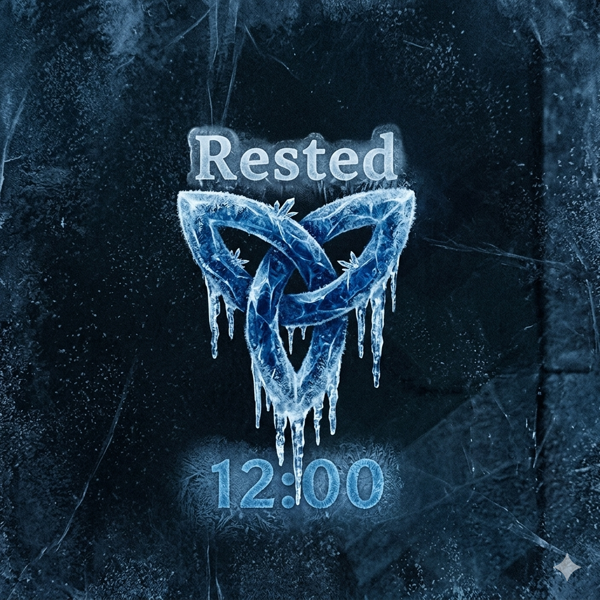

# ValheimFreezeRestedTimer

A lightweight Valheim mod that freezes the Rested buff timer, keeping it permanently active while playing.



## Features

- **Zero Performance Impact:** Modifies only the required logic without heavy polling or update loops.
- **No Configuration Needed:** Just drop the file and play.
- **Vanilla Friendly:** Safe to use in multiplayer (client-side).

## Installation

### Automatic (Recommended)

1. Go to the [Releases](https://github.com/vsDizzy/ValheimFreezeRestedTimer/releases) page.
2. Download the latest `ValheimFreezeRestedTimer.dll`.
3. Move the downloaded `.dll` file into your `BepInEx/plugins/` directory.

### Manual Compilation

If you prefer to compile the script yourself, you can use the standard C# compiler:

```bash
csc /target:library /out:ValheimFreezeRestedTimer.dll /reference:assembly_valheim.dll /reference:UnityEngine.CoreModule.dll /reference:0Harmony.dll ValheimFreezeRestedTimer.cs
```
